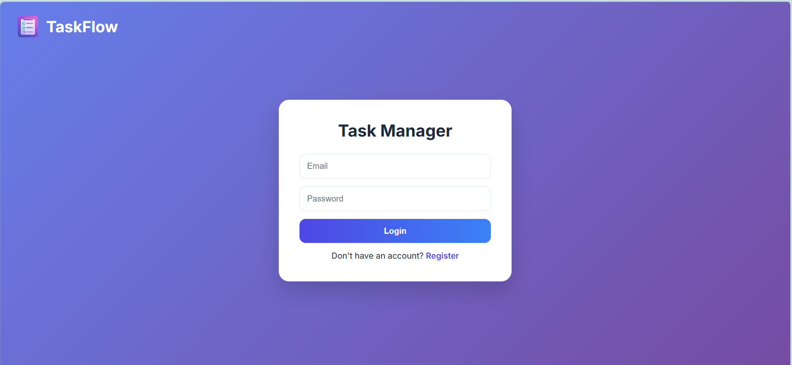
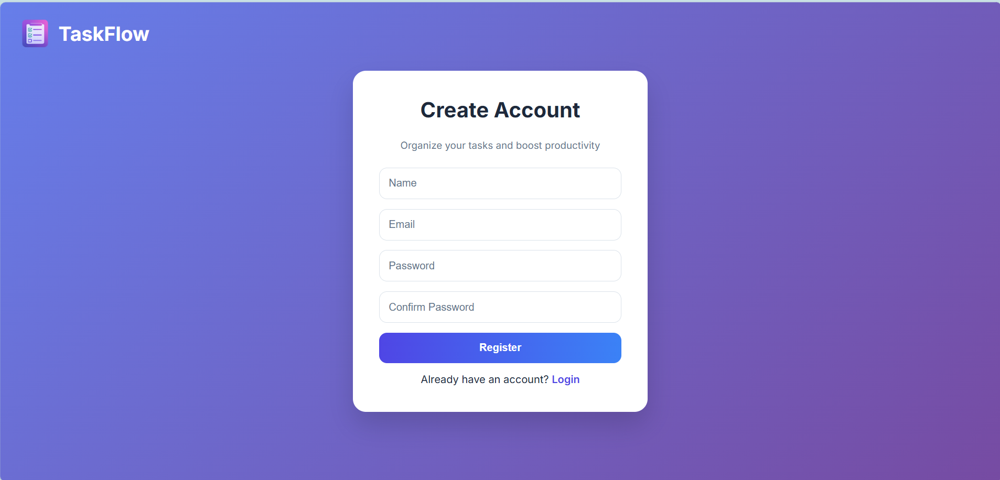
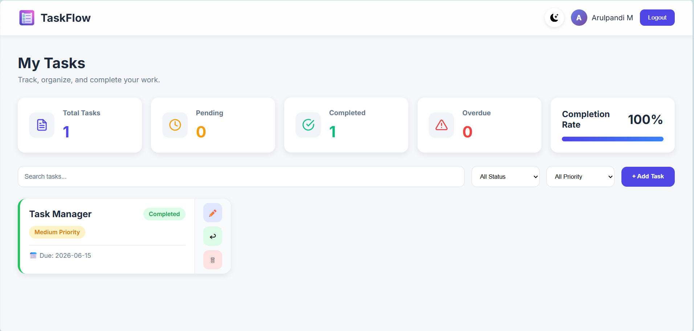
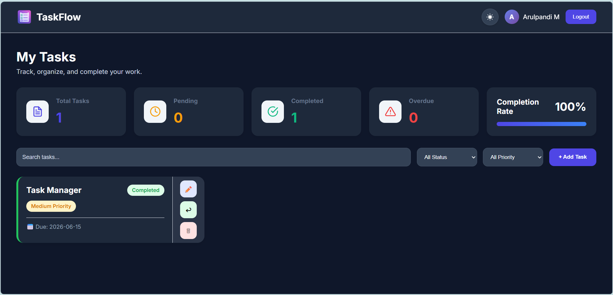

# 🚀 TaskFlow

TaskFlow is a modern task management web application built with React. It helps users organize their work efficiently by creating, managing, and tracking tasks through a clean and responsive interface.

## 🌐 Live Demo

https://taskflow-rho-ochre.vercel.app/

## ✨ Features

### Authentication

* User Registration
* User Login
* Logout Functionality
* Protected Dashboard Access
* User-specific Task Management

### Task Management

* Create Tasks
* Edit Tasks
* Delete Tasks
* Mark Tasks as Completed
* Undo Completed Tasks
* Task Priority Levels (High, Medium, Low)
* Due Date Management

### Productivity Features

* Search Tasks
* Filter by Status
* Filter by Priority
* Overdue Task Detection
* Completion Rate Tracking
* Task Statistics Dashboard

### User Experience

* Responsive Design
* Dark Mode Support
* Theme Persistence
* Modern UI Design
* Empty State Handling
* Mobile-Friendly Layout

### Data Persistence

* Local Storage Integration
* User Session Persistence
* Theme Preference Persistence

## 🛠️ Tech Stack

* React
* React Router DOM
* JavaScript (ES6+)
* CSS3
* Local Storage
* Vite
* Vercel

## 📸 Screenshots

### Login Page



### Register Page



### Dashboard



### Dark Mode



## 🚀 Installation

Clone the repository:

```bash
git clone https://github.com/Arulpandi11/taskflow.git
```

Navigate to the project folder:

```bash
cd taskflow
```

Install dependencies:

```bash
npm install
```

Start the development server:

```bash
npm run dev
```

Build for production:

```bash
npm run build
```

## 📂 Project Structure

```text
src/
├── components/
│   ├── Navbar
│   ├── TaskCard
│   ├── TaskForm
│   └── StatsCard
├── pages/
│   ├── Login
│   ├── Register
│   └── Dashboard
├── App.jsx
└── main.jsx
```

## 🎯 Learning Outcomes

Through this project, I gained hands-on experience with:

* React State Management
* Component-Based Architecture
* React Router Navigation
* CRUD Operations
* Local Storage Persistence
* Authentication Flow
* Responsive UI Design
* Deployment with Vercel
* Git and GitHub Workflow

## 👨‍💻 Author

Arulpandi M

## 📄 License

This project is open source and available under the MIT License.
